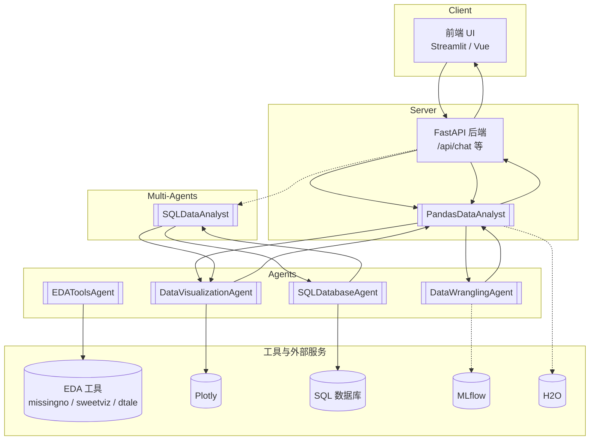
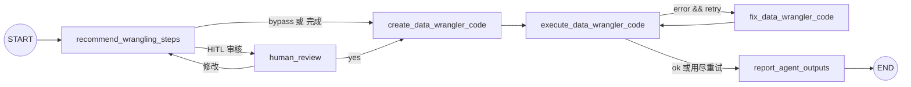
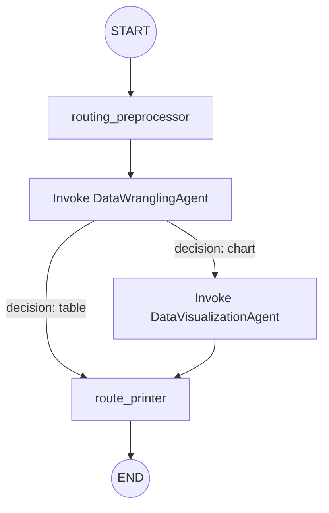
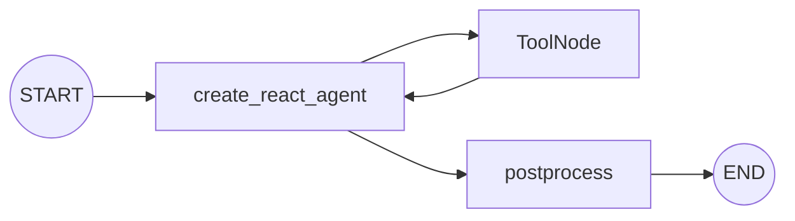

## 目标

- 总结本项目的技术原理与架构设计
- 梳理单个智能体（agent）的运行流程与输入/输出
- 说明多智能体（multi-agents）的编排与交互机制
- 给出在当前项目中新增智能体与实现编排的实践指南

## 方案总览（Executive Summary）

- 本方案基于 LangGraph 的状态图（StateGraph）与 LangChain 的可组合流水线（LCEL）实现“可编排、可中断、可恢复”的智能体体系。
- 智能体分为两类：
  - 工具型（ReAct/Tool-Calling）：用 `create_react_agent + ToolNode` 选择并调用 `tools/` 中的原子能力。
  - 代码生成-执行型：LLM 生成受控的单函数代码，运行失败进入修复与重试，支持 HITL。
- 多智能体通过路由预处理与条件边在主图中编排，统一返回 JSON 产物（数据表、Plotly 图、报告路径等），便于前后端消费。

## 文档导览与阅读路径

- 建议阅读顺序：
  1) [项目架构](#项目架构)：目录与模块职责
  2) [技术原理概述](#技术原理概述)：核心技术栈与思路
  3) [LangGraph 知识补充](#langgraph-知识补充)：状态图、节点/边、Checkpointer、HITL
  4) [基于 LangChain 开发智能体的通用方案](#基于-langchain-开发智能体的通用方案)：核心概念与通用步骤
  5) [单个智能体运行流程](#单个智能体运行流程)：工具型与代码生成-执行型对比
  6) [多智能体编排与交互](#多智能体编排与交互)：路由、子图调用与结果汇总
  7) [将 HITL 融入智能体流程（模块化集成指南）](#将-hitl-融入智能体流程模块化集成指南)：中断/恢复/人工审阅
  8) [如何新增一个智能体](#如何新增一个智能体) 与 [如何实现新的编排（多智能体）](#如何实现新的编排多智能体)：落地指南
  9) [关键工程实践](#关键工程实践) 与 [Checklist](#在本项目中快速落地一个新智能体checklist)：交付与质量
  10) [架构图（Mermaid）](#架构图mermaid)：整体与关键流程图

## 术语与缩写

- HITL：Human-In-The-Loop（本方案中以“HITL”直接标注）
- LCEL：LangChain Expression Language，可组合运行单元的流水线语法
- StateGraph/CompiledStateGraph：LangGraph 状态工作流与其可执行工件

## 技术原理概述

- **框架核心**：基于 LangGraph 的 `StateGraph/CompiledStateGraph` 构建“有状态的工作流图”，由节点（node）与有向边（edge/conditional edges）组成。
- **统一封装**：`templates/BaseAgent` 继承自 `CompiledStateGraph`，为所有智能体提供统一的生命周期入口（`invoke/ainvoke/stream`）、`response` 存储、`show()` 可视化、参数热更新（`update_params`）、状态读取与历史等通用能力。
- **两类智能体形态**：
  - 工具型（Tool-Calling/ReAct）：通过 `langgraph.prebuilt.create_react_agent + ToolNode` 调度注册在 `tools/` 下的工具函数（例如 `ds_agents/EDAToolsAgent` 调用 `tools/eda.py`）。
  - 代码生成-执行型（Coding Agent）：由 LLM 生成特定函数代码，随后在受控环境内 `exec` 执行，失败则进入“修复-重试-解释-汇报”链（例如 `agents/DataWranglingAgent`、`agents/DataCleaningAgent`、`agents/SQLDatabaseAgent`）。
- **HITL**：通过 `templates.node_func_human_review()` 与 `interrupt()` 注入人工确认，需提供 `Checkpointer`（默认可用 `MemorySaver`）。
- **重试与修复**：通用的 `node_func_fix_agent_code()` 使用 LLM + `PythonOutputParser` 对上一步失败的代码进行增量修复，受 `max_retries/retry_count` 控制。
- **产物与可序列化**：所有返回值均为 JSON 可序列化（如 `plotly` 图对象转 dict、`DataFrame` 转 dict），便于前后端与多智能体之间传递。

## 项目架构

- `ai_data_science_team/templates/`：基础模板与通用节点函数
  - `BaseAgent`、`create_coding_agent_graph`、`node_func_execute_agent_code_on_data`、`node_func_fix_agent_code`、`node_func_explain_agent_code`、`node_func_report_agent_outputs` 等。
- `ai_data_science_team/tools/`：工具库（EDA、数据读写、可视化、MLflow、H2O、SQL 等），供工具型智能体调用。
- `ai_data_science_team/agents/`：单体智能体（数据清洗、整理、可视化、SQL 等），多为“代码生成-执行型”。
- `ai_data_science_team/ds_agents/`：数据科学类工具型智能体，例如 `EDAToolsAgent`。
- `ai_data_science_team/ml_agents/`：机器学习/运维相关智能体（H2O、MLflow）。
- `ai_data_science_team/multiagents/`：多智能体编排（如 `PandasDataAnalyst`、`SQLDataAnalyst`），通过路由节点把多个子智能体拼装为完整工作流。
- `apps/*`：参考应用（前端 + 后端）展示如何注入 LLM、实例化智能体并消费其 JSON 结果。

## 单个智能体运行流程

### 1) 工具型智能体（以 `EDAToolsAgent` 为例）

- 组成：`create_react_agent` + `ToolNode(tools=EDA_TOOLS)`，工具集合来自 `tools/eda.py`：
  - `explain_data`：生成数据叙述性总结（形状、类型、缺失、样本、可选统计）。
  - `describe_dataset`：`DataFrame.describe()` 数值统计，返回文本 + 结构化 `artifact`。
  - `visualize_missing`：基于 `missingno` 的缺失值可视化（返回 base64 图像）。
  - `generate_correlation_funnel`：基于 `pytimetk` 的特征-目标相关漏斗，返回 `plotly` 图与数据。
  - `generate_sweetviz_report`：生成并保存 HTML EDA 报告（返回路径/HTML）。
  - `generate_dtale_report`：启动 `dtale` 并返回交互式探索 URL。
- 输入：`{"user_instructions": str, "data_raw": dict}`，其中 `data_raw` 为 `DataFrame.to_dict()`。
- 过程：LLM 基于 ReAct 选择/调用一个或多个工具，`EDAToolsAgent` 汇总 `messages/internal_messages/tool_calls/eda_artifacts`。
- 输出：`messages`（最终 AI 总结）、`eda_artifacts`（最近一次工具产物）、`tool_calls`（工具调用轨迹）。

### 2) 代码生成-执行型智能体（以 `DataWranglingAgent` 为例）

- GraphState 关键字段：`user_instructions`、`data_raw`、`recommended_steps`、`data_wrangler_function(_name/_path)`、`data_wrangled`、`data_wrangler_error`、`max_retries/retry_count`。
- 核心节点链：
  1. 推荐步骤（可选）：汇总多数据集摘要 `get_dataframe_summary()`，提示 LLM 产出“推荐整理步骤”。
  2. HITL（可选）：展示步骤与当前代码片段，人工确认或修改。
  3. 生成代码：LLM 产出单函数、可执行的 `data_wrangler()`，并内联所有 import；保存日志（可选）。
  4. 执行代码：`node_func_execute_agent_code_on_data()` 将 `data_raw(dict/list)` 规范化为 `DataFrame` 或 `List[DataFrame]`，`exec` 后调用目标函数并产出 `data_wrangled(dict)`。
  5. 条件修复：若有错误且可重试，进入修复节点，利用 `PythonOutputParser` 约束 LLM 仅返回函数定义，递增重试计数后回到执行。
  6. 解释/汇报（可选）：对最终代码进行解释或结构化汇报（不使用 LLM或可使用 LLM 解释）。
- 输入/输出：
  - 输入：`{"user_instructions": str, "data_raw": dict|list, "max_retries": int, "retry_count": int}`
  - 输出（部分）：`{"data_wrangled": dict, "data_wrangler_function": str, "messages": [AIMessage], ...}`

## 多智能体编排与交互

### `PandasDataAnalyst`（数据整理 + 可视化）

- 路由预处理：使用 `PromptTemplate + LLM + JsonOutputParser` 抽取：
  - `user_instructions_data_wrangling`：传给整理智能体的规范化指令
  - `user_instructions_data_visualization`：可视化指令（若需要图表）
  - `routing_preprocessor_decision`：`chart|table` 决策
- 执行链：
  1. 节点一：预处理路由，生成三项字段
  2. 节点二：调用 `DataWranglingAgent`，产出 `data_wrangled`
  3. 条件边：若决策为 `chart`，进入 `DataVisualizationAgent`，其输入为 `data_wrangled`（若存在）否则原始数据；若为 `table`，直接结束
  4. 终结节点：打印/汇总路由结果，`messages` 聚合
- 前后端集成：`apps/pandas-data-analyst-app/backend/main.py` 在 `/api/chat` 中实例化三个智能体并串行调用，最终将 `plotly_graph`、`data_wrangled`、文本总结一并返回给前端。

### `SQLDataAnalyst`（SQL 抽取 + 可视化）

- 结构与上面类似，只是第一阶段由 `SQLDatabaseAgent` 负责生成/执行 SQL 与取数，随后进入 `DataVisualizationAgent`。

## 如何新增一个智能体

> 判断需求选择“工具型”或“代码生成-执行型”，二者皆可无缝接入编排。

1) 选择目录与命名
- 工具型：在 `tools/` 新增工具函数（使用 `@tool` 与 `InjectedState` 注入共享状态），在 `ds_agents/` 新建 `XxxToolsAgent` 与 `make_xxx_tools_agent()`。
- 代码生成-执行型：在 `agents/` 新建 `XxxAgent(BaseAgent)` 与 `make_xxx_agent()`，复用 `templates/create_coding_agent_graph` 与通用节点函数。

2) 定义 GraphState 与节点
- 明确输入数据结构（如 `data_raw: dict|list`）、产物（如 `plotly_graph`/`data_processed`/`code_snippet`）与错误键（如 `xxx_error`）。
- 设计节点：推荐步骤（可选）、生成代码、执行、修复、解释/汇报、人工复核（可选）。
- 指定有向边与条件边（错误分支、人工分支、路由分支等）。

3) 返回可序列化结果
- `DataFrame` 统一转 `dict`；`plotly` 统一转 `dict`；文件路径/URL 使用字符串。

4) 可选能力
- `human_in_the_loop=True` 需提供 `checkpointer`（如 `MemorySaver`）。
- `log=True` + `log_path` 可持久化代码产物，便于审计与回溯。

5) 导出与使用
- 在 `ai_data_science_team/__init__.py` 导出新类。
- 在 `apps/*/backend` 实例化并接入路由/接口，前端按需要解析 JSON 结果即可。

## 如何实现新的编排（多智能体）

> 在 `multiagents/` 新建 `XxxOrchestrator(BaseAgent)` 与 `make_xxx_orchestrator()`，把一个或多个子智能体的 `_compiled_graph` 注入，定义路由与数据传递。

- 典型步骤：
  1. 设计“路由预处理”Prompt，使用 `LLM + JsonOutputParser` 产出结构化路由字段
  2. 添加子智能体调用节点：调用 `.invoke({ ... })`，并把其输出选择性写回主 State
  3. 使用条件边将控制权流向下一个子智能体或结束
  4. 在终结节点聚合 `messages` 与核心产物，形成清晰的最终输出

- 示例思路：新增一个“EDA Supervisor”
  - 路由：判断“数据整理 / EDA 工具 / 可视化 / 报告导出”等分流
  - 按需调用 `DataWranglingAgent`、`EDAToolsAgent`、`DataVisualizationAgent`
  - 汇总生成结构化工作流摘要，前端按需渲染表格/图表/报告链接

## 关键工程实践

- 统一数据接口：优先在边界层做 `DataFrame <-> dict` 转换，避免在子智能体里重复判断。
- 代码生成规范：函数名可配置（如 `function_name`），所有 `import` 放函数内，保证可移植与多模型兼容。
- 错误与重试：把错误消息写入专用 `*_error` 键，通过条件边控制“修复/解释/结束”。
- 可观测性：使用 `get_workflow_summary()` 与 `messages` 形成“过程报告”，必要时开启 `log`。
- 安全性：仅执行单函数、受控局部命名空间；严格 JSON 化跨模块传参。

## 在本项目中快速落地一个新智能体（Checklist）

- 在 `tools/` 或 `agents/` 创建能力实现（工具或代码生成）
- 在 `ds_agents/` 或 `agents/` 提供 `XxxAgent(BaseAgent)` + `make_xxx_agent()`
- 定义 GraphState、节点、边与错误键，保证所有输出 JSON 可序列化
- （可选）接入 HITL 与日志
- 在 `__init__.py` 导出类
- （可选）在 `multiagents/` 新建编排器，路由到多个子智能体
- 在 `apps/*/backend` 接入 API，前端消费 JSON 产物

## LangGraph 知识补充

### 核心概念

- **StateGraph**：描述一张“有状态”的工作流图，由节点（Node）与边（Edge/ConditionalEdge）组成。
- **CompiledStateGraph**：将 `StateGraph` 编译后的可执行工件，提供 `invoke/ainvoke/stream/astream/get_state/...` 等接口。
- **START/END**：图的入口与出口。必须从 `START` 至至少一个终止路径 `END`。
- **Node**：可执行的函数（通常签名为 `def node(state): -> dict` 或返回 `Command`）。
- **State（状态）**：节点之间传递的“单一事实来源”，建议用 `TypedDict` 显式建模字段与类型。
- **Aggregator（聚合器）**：当某键需要跨多次更新聚合时，使用 `Annotated[Type, operator.add]` 等来定义合并规则（如消息列表累积）。

### 状态建模与聚合器

- 使用 `TypedDict` 定义 State 字段，保证可读性与类型友好：
  - 业务字段：如 `user_instructions`、`data_raw`、`plotly_graph` 等。
  - 控制字段：如 `max_retries`、`retry_count`、`*_error`。
  - 聚合字段：如 `messages: Annotated[Sequence[BaseMessage], operator.add]`，可在多节点间累积信息。

### 节点、边与条件边

- `workflow.add_node(name, fn)`：注册节点；
- `workflow.add_edge(src, dst)`：添加确定性边；
- `workflow.add_conditional_edges(src, router_fn, mapping)`：基于 `router_fn(state)` 的返回值经 `mapping` 映射到不同分支；
- `workflow.set_entry_point(name)`：设置首个节点；常规情况下也可从 `START` 指向首节点；
- 路由函数模式：如 `return "chart" if condition else "table"`，在编排中非常常见。

### 执行与编译

- `app = workflow.compile(...)` 获得 `CompiledStateGraph`；
- 同步执行：`app.invoke({ ... })`；
- 异步执行：`await app.ainvoke({ ... })`；
- 流式调试：`app.stream(..., stream_mode=["values"|"updates"|"debug"])`；
- 运行后可通过 `get_state/get_state_history/update_state` 观察或修改状态。

### Checkpointer、interrupt 与 HITL

- **Checkpointer**：用于保存/恢复图的执行状态（如 `MemorySaver`）。在人类中断确认时非常关键。
- **interrupt()**：在节点中触发“中断等待外部输入”，返回后根据输入继续执行；
- **Command**：节点可返回 `Command(goto="下一节点", update={...})` 来显式控制跳转与状态更新；
- HITL 通用做法：
  - 节点中构造需人工确认的文本/代码片段；
  - 调用 `interrupt(prompt)` 等待外部“yes/修改意见”；
  - 分支：`yes -> 下一步`，`no -> 回到推荐/修复节点`。

### Tool-Calling（ReAct）与状态注入

- `create_react_agent(model, tools=ToolNode([...]), state_schema=...)` 生成“可调用工具”的智能体节点；
- `@tool` 装饰器声明工具，`response_format` 可选 `"content"` 或 `"content_and_artifact"`；
- `InjectedState("key")`：在工具签名中注入来自上游 State 的字段（如 `data_raw`），避免用户手写传参；
- 工具返回的 `artifact` 建议为可序列化结构（dict/list/base64/URL/path）。

### 路由与多智能体编排模式

- **预处理路由**：使用 `PromptTemplate + LLM + JsonOutputParser` 将自由文本路由为结构化字段（如是否绘图/返回表格、拆分不同子任务指令）。
- **子图调用**：将子智能体的 `_compiled_graph` 作为依赖注入，在主图节点中直接 `subgraph.invoke({...})`，并将其结果写回主 State；
- **条件边**：基于路由结果切换不同子智能体，如“Table -> 结束”，“Chart -> 可视化智能体”；
- **消息汇总**：用聚合器累计各子智能体报告，最后统一汇报。

### 调试与可观测性

- `get_graph().draw_mermaid_png()`：可视化流程图；
- `stream_mode="debug"`：输出逐节点事件；
- 产物与日志：将关键代码/路径/URL/错误写入 State，前端或日志系统易于消费。

### 错误恢复与重试

- 错误键：为每一步定义 `*_error` 字段；
- 条件修复：`add_conditional_edges(execute, lambda s: "fix" if error_and_can_retry(s) else "explain", {...})`；
- 修复节点：使用 LLM + 约束解析器（如 `PythonOutputParser`）仅返回所需函数定义，递增 `retry_count` 再回到执行节点。

### 并行与吞吐

- LangGraph 支持通过条件边“扇出”多分支；若多分支间无数据竞争，可拆分为多个并行子图（在实现上通常由上层执行器并行触发）。
- 聚合合并：多分支回合并到同一键时，使用聚合器定义合并策略（如合并列表/字典）。

### 最佳实践清单

- 显式建模 State（TypedDict + 注释），统一 JSON 序列化边界；
- 路由前置，拆分子任务指令，降低每个子智能体复杂度；
- 代码生成型只执行“单函数、内联 import”的受控代码；
- 错误-修复-重试闭环，记录 `*_error` 与 `retry_count`；
- 工具返回结构化 `artifact`，避免解析脆弱文本；
- 打开 `log/checkpointer` 以获得可回溯与可恢复能力；
- 前后端一致的产物协议（如 `plotly_dict`、`df_dict`）。

### 极简示例

```python
from typing import TypedDict, Annotated, Sequence
import operator
from langgraph.graph import StateGraph, START, END

class S(TypedDict):
    messages: Annotated[Sequence[str], operator.add]
    x: int

def step1(state: S):
    return {"messages": ["step1"], "x": state.get("x", 0) + 1}

def router(state: S):
    return "again" if state["x"] < 3 else "done"

def step2(state: S):
    return {"messages": ["step2"], "x": state["x"] + 1}

g = StateGraph(S)
g.add_node("step1", step1)
g.add_node("step2", step2)
g.add_edge(START, "step1")
g.add_conditional_edges("step1", router, {"again": "step2", "done": END})
g.add_edge("step2", "step1")
app = g.compile()

result = app.invoke({"messages": [], "x": 0})
# result["messages"] -> ["step1", "step2", "step1", "step2", "step1"]
```


## 基于 LangChain 开发智能体的通用方案

### 核心概念

- 模型抽象（LLM/ChatModel/Embedding）：统一 `.invoke()` 接口与可组合的 Runnable（LCEL）流水线。
- Prompt 模板（PromptTemplate/ChatPromptTemplate）：参数化提示，便于复用与测试。
- 输出解析器（OutputParser）：把自由文本约束为结构化输出（JSON、Pydantic、代码片段）。
- 工具（Tools）：用 `@tool` 暴露原子能力，支持 ReAct/Tool-Calling；与 `InjectedState` 协作进行状态注入。
- 记忆/检查点：LangChain 侧对话记忆，LangGraph 侧 `Checkpointer` 支持中断/恢复与 HITL。
- 可组合执行（LCEL）：如 `prompt | model | parser`，将步骤装配成可复用算子。

### 通用步骤

1) 明确任务与产物
- 输入（数据/参数）、输出（JSON/图/表/代码）、失败策略（错误键、重试上限）。

2) 选择开发模式
- 工具型（ReAct/Tool-Calling）：查询+选择工具的工作负载。
- 代码生成-执行：由 LLM 产出函数代码并在受控环境执行。
- 纯推理对话：仅结构化问答与解释，无工具/执行。

3) 设计 Prompt 与解析器
- 以模板组织上下文（用户指令、数据摘要、历史等）。
- 采用 `JsonOutputParser`、`PydanticOutputParser` 或专用解析器（如 Python 代码解析器）。

4) 实现工具
- 使用 `@tool` 暴露能力，返回 JSON 可序列化的结果（dict/list/base64/URL）。
- 如需共享上游状态，使用 `InjectedState("key")` 注入。

5) 组织执行流
- 轻量：`prompt | model | parser`。
- 带工具：`create_react_agent(model, tools=ToolNode([...]))`。
- 多步骤/可中断：用 LangGraph `StateGraph` 建节点与（条件）边，编译为 `CompiledStateGraph`。

6) 加入 HITL 与重试
- 关键节点前后插入审核节点（HITL），失败进入修复节点并重试。

7) 封装为类与接口
- 提供 `XxxAgent(BaseAgent)` + `make_xxx_agent()`；
- 实现 `invoke_agent/ainvoke_agent` 与产物访问器（如 `get_plotly_graph()`）。

8) 集成到编排器
- 在 `multiagents/` 通过路由预处理拆分子任务，注入各子智能体 `_compiled_graph`，统一汇总输出。

### 代码骨架示例（工具型 ReAct）

```python
from langgraph.prebuilt import create_react_agent, ToolNode
from langchain.tools import tool

@tool
def essential_stat(data: dict) -> str:
    """Return basic statistics of a dataset."""
    return str({"rows": len(next(iter(data.values()), []))})

def make_agent(model):
    tool_node = ToolNode(tools=[essential_stat])
    return create_react_agent(model, tools=tool_node)

def run(model, data, question):
    agent = make_agent(model)
    return agent.invoke({
        "messages": [("user", question)],
        "data_raw": data,
    })
```

### 代码骨架示例（代码生成-执行）

```python
from typing import TypedDict
from langgraph.graph import StateGraph, END
from ai_data_science_team.templates import (
    create_coding_agent_graph,
    node_func_execute_agent_code_on_data,
    node_func_fix_agent_code,
)

class GraphState(TypedDict):
    user_instructions: str
    data_raw: dict
    code_snippet: str
    result: dict
    agent_error: str
    max_retries: int
    retry_count: int

def create_code(state: GraphState):
    code = (prompt | llm | PythonOutputParser()).invoke({
        "user_instructions": state["user_instructions"],
    })
    return {"code_snippet": code}

def execute(state: GraphState):
    return node_func_execute_agent_code_on_data(
        state,
        data_key="data_raw",
        code_snippet_key="code_snippet",
        result_key="result",
        error_key="agent_error",
        agent_function_name="fn",
    )

def fix_code(state: GraphState):
    return node_func_fix_agent_code(
        state,
        code_snippet_key="code_snippet",
        error_key="agent_error",
        llm=llm,
        prompt_template="...",
        agent_name="my_agent",
    )

workflow = StateGraph(GraphState)
workflow.add_node("create_code", create_code)
workflow.add_node("execute", execute)
workflow.add_node("fix", fix_code)
workflow.set_entry_point("create_code")
workflow.add_edge("create_code", "execute")
workflow.add_conditional_edges(
    "execute",
    lambda s: "fix" if s.get("agent_error") and s["retry_count"] < s["max_retries"] else "END",
    {"fix": "fix", "END": END},
)
app = workflow.compile()
```

## 将 HITL 融入智能体流程（模块化集成指南）

- 启用方式（单体智能体）：
  - 在构建函数中打开 `human_in_the_loop=True`，并提供 `checkpointer`（未提供时可使用 `MemorySaver()`）。
  - 若使用通用 `create_coding_agent_graph`，框架会在执行节点后根据是否报错分支到修复或 HITL 审核节点；也可像 `DataWranglingAgent` 那样在“推荐步骤”之后手动插入 `human_review` 节点，进行“预执行”人工确认。

- 节点接入（推荐形态）：
  - 预执行审核：`recommended_steps -> human_review -> create_code`
  - 失败分支审核（可选）：`execute -> (error && can_retry ? fix_code : human_review/explain)`
  - 使用 `templates.node_func_human_review()` 快速创建审核节点：返回 `Command(goto=..., update=...)`，当输入为 `"yes"` 时直达后续节点，否则把用户修改合并进 `state[user_instructions]` 再回到推荐/生成节点。

- 前后端交互（关键点）：
  - HITL 通过 `interrupt()` 触发人工输入暂停；需使用 `checkpointer` 保存会话状态。
  - 前端获取中断提示后，采集用户输入（`yes` 或修改意见文本），再调用后端继续执行接口，将该输入传回以恢复流程（由框架根据 `Command` 的 `goto/update` 恢复到正确节点）。

- 多智能体集成：
  - 在编排器（如 `PandasDataAnalyst`）中，可仅在子智能体内部启用 HITL；也可在路由器后置一个全局审核节点做任务级确认。
  - 如果顶层也需要中断与恢复，顶层图同样应配置 `checkpointer`，并在 UI 侧使用统一的“中断恢复”通道。

- 最小示例（要点示意）：

```python
# 假定已有 node_functions = { "recommend": ..., "human_review": ..., "create_code": ..., "execute": ..., "fix": ..., "explain": ... }
from langgraph.checkpoint.memory import MemorySaver
app = create_coding_agent_graph(
    GraphState=GraphState,
    node_functions=node_functions,
    recommended_steps_node_name="recommend",
    create_code_node_name="create_code",
    execute_code_node_name="execute",
    fix_code_node_name="fix",
    explain_code_node_name="explain",
    error_key="agent_error",
    human_in_the_loop=True,                 # 开启 HITL
    human_review_node_name="human_review", # 指定审核节点
    checkpointer=MemorySaver(),             # 启用检查点保存/恢复
)
```


## 架构图（Mermaid）

### 项目整体架构



### DataWranglingAgent 状态图



### PandasDataAnalyst 编排



### EDAToolsAgent（ReAct + 工具）



